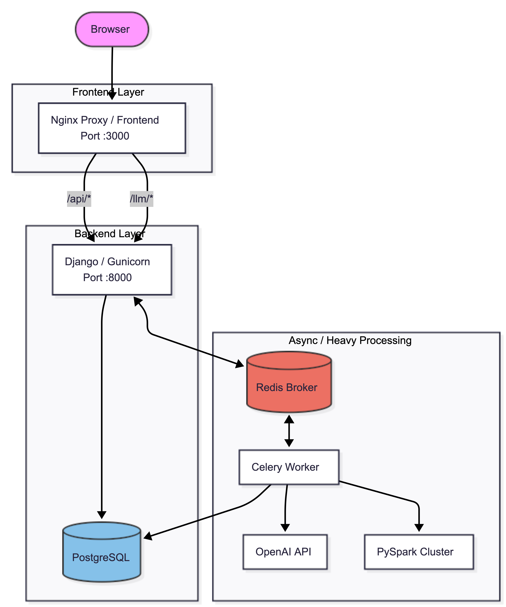

# NL Transform — Full Stack

Monorepo for the natural-language CSV/Excel transform platform: **React** frontend + **Django / Celery / Redis / PySpark** backend.

Upload a file, describe a pattern in plain English, and run async regex or literal replacements at scale.

## Architecture




| Directory | Stack | Role |
|---|---|---|
| `frontend/` | React 19, Vite, MUI, TanStack Query | Upload UI, job polling, paginated results |
| `backend/` | Django, Celery, Redis, PostgreSQL, PySpark | REST API, async jobs, Spark transforms |

## Quick start (Docker — recommended)

One command brings up the full stack: database, Redis, API, Celery worker, Flower, and the React UI.

```bash
cd nl-transform
cp .env.example .env
# Edit .env — set OPENAI_API_KEY and DJANGO_SECRET_KEY
docker compose up --build
```

| Service | URL |
|---|---|
| **Web app (UI)** | http://localhost:3000 |
| API (direct) | http://localhost:8000 |
| Health | http://localhost:8000/api/health |
| Metrics | http://localhost:8000/api/metrics |
| Flower | http://localhost:5555 |

The UI is served by nginx and proxies `/api` and `/llm` to the Django service, so no CORS setup is needed in the browser.

### Stop / reset

```bash
docker compose down          # stop containers
docker compose down -v       # stop and remove DB + media volumes
```

## Local development (without Docker UI)

Run infrastructure in Docker, apps on the host:

```bash
# Infra only
docker compose up db redis -d

# Backend (from backend/)
cp ../.env.example .env   # or symlink ../.env
uv sync
export DJANGO_SETTINGS_MODULE=nltoregex.settings.local
uv run manage.py migrate
uv run manage.py runserver

# Celery worker (second terminal)
uv run celery -A nltoregex worker -l info --pool=solo

# Frontend (third terminal, from frontend/)
npm ci
npm run dev    # http://localhost:5173 — Vite proxies /api and /llm to :8000
```

Requires PostgreSQL credentials in `.env` (`POSTGRES_HOST=localhost` when using `docker compose up db redis -d`).

## Environment variables

Copy `.env.example` to `.env` at the **repo root**. Docker Compose passes it to `web` and `worker`.

Required:

- `OPENAI_API_KEY` — LLM regex/literal generation
- `DJANGO_SECRET_KEY` — Django signing key

See `.env.example` for Postgres, Redis, upload limits, and port overrides (`FRONTEND_PORT`, `WEB_PORT`, `FLOWER_PORT`).

## Tests

From `backend/`:

```bash
DJANGO_SETTINGS_MODULE=nltoregex.settings.test uv run manage.py test uploads llmtoregex llmtoregex.test_task_progress uploads.test_metrics
```

Spark integration tests (Java required):

```bash
DJANGO_SETTINGS_MODULE=nltoregex.settings.test INTEGRATION_TEST_ROWS=5000 uv run manage.py test llmtoregex.tests_integration
```

## Large dataset smoke test

```bash
cd backend
uv run python scripts/generate_large_csv.py --rows 100000 --output large_test.csv
# Upload via UI at http://localhost:3000
```
# Demo Video


## Further reading

- [`backend/README.md`](backend/README.md) — API endpoints, Spark partitioning, Redis layout, observability
- [`frontend/README.md`](frontend/README.md) — frontend dev notes

## Trade-offs

- Uploads stream to disk in the web process; Spark runs in the Celery worker.
- Results are paginated JSON from Parquet — not a full-file download.
- Worker uses Spark local mode with 8 shuffle partitions (~2 GB driver memory).
- Regex validation blocks nested quantifiers; not a full ReDoS guarantee.
